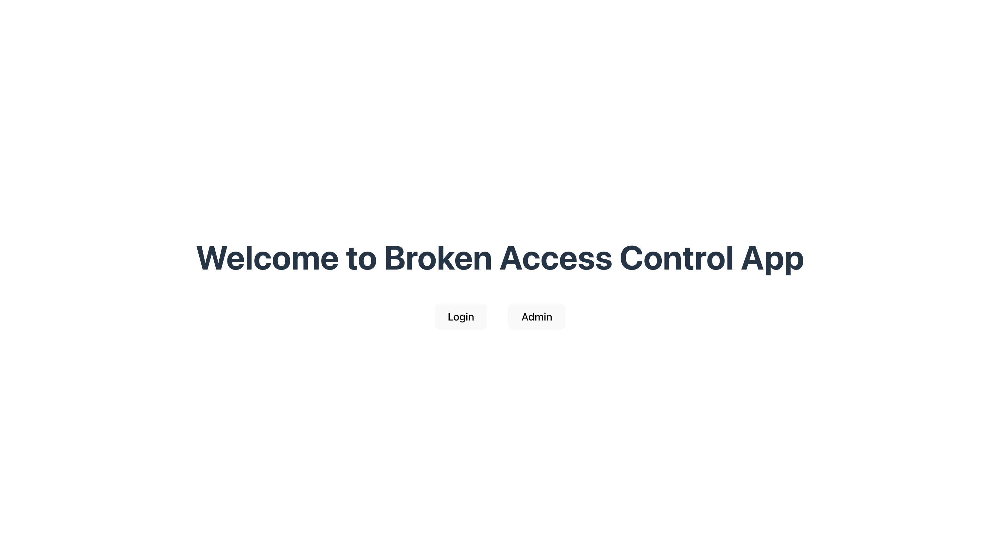

# Broken Access Control

## Intro
Broken Access Control is a security vulnerability that occurs when applications do not properly enforce user permissions and restrictions, allowing unauthorized access to resources, functionalities, or data. It is a critical issue in the OWASP Top 10 list of web application security risks.

## Common Causes of Broken Access Control
1. **Missing Authentication & Authorization Checks** - Users can perform actions or access data withour proper verification.

2. **Insecure Direct Object References (IDOR)** - Attackers manipulate URLs or request parameters to access unauthorized data (e.g., changing /profile?id=123 to /profile?id=124).

3. **Privilege Escalation** - Users gain higher privileges than intended due to weak role enforcement.

4. **Exposed APIs & Endpoints** - Users can perform actions or access data withour proper verification.

5. **CORS Misconfiguration** - Poor Cross-Origin Resource Sharing settings enable attackers to bypass access controls.

6. **Lack of Session Expiry** - Users remain authenticated indefinitely, increasing risk if credentials are compromised.

7. **Forced Browsing** - Attackers manually navigate to restricted pages or functions that lack proper access controls.

## Examples of Broken Access Control Attacks

- **IDOR Exploit**: A user modifies a URL from example.com/invoice/1001 to example.com/invoice/1002 and views another user's invoice.
- **Unauthorized API Access**: An attacker sends API requests to modify or delete data they shouldn't have access to.
- **Privilege Escalation**: A normal user changes their role to "admin" by modidfying a request parameter.
### Run the docker compose file

Using the docker compose command run:

`docker compose up`

*docker-compose file is in the same directory.*

Vist the frontend app at:

[http://localhost:5173/](http://localhost:5173/)

It is a simple React app with login page and a broken access page.

[Click on Admin page link](http://localhost:5173/admin); you will be taken to admin page with needing authentication.

**Notes:** The application's access is broken, the backend API didn't implement authentication to access the private routes.

This is called a broken access vulnerability.

### Learn About Mitigation Strategies

[Visit here](./Fixed_Broken_Access_Control/)